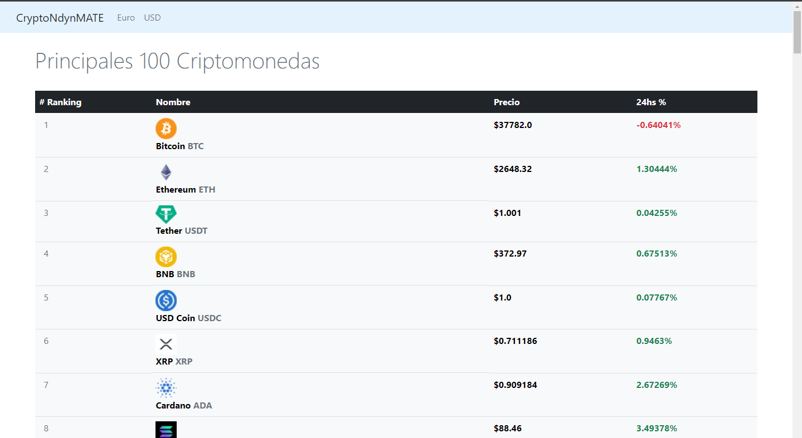

# Proyecto Spring Boot API CoinGecko
Inicio de proyecto sobre criptomonedas con Spring Boot y Spring Data JPA. En esta primera fase se ha integrado la API de CoinGecko y se han prepara una landing page con una lista de criptomonedas con los valores actualizados imagen, símbolo, nombre, precio y porcentaje de las últimas 24hs. Puede consultar la documentación de la API en https://www.coingecko.com/api/documentation

Los valores están expresados en USD y Euro

### TODO

- Posibilidad de registro de usuario y la creación de portfolios

- Simulador de trading de operaciones de compra y venta de criptomonedas con un crédito ficticio.
- Convertidor de monedas
- Función whatif para calcular valores hipotéticos

## Resources

- [CoinGecko API](https://www.coingecko.com/en/api/documentation)

## Samples

